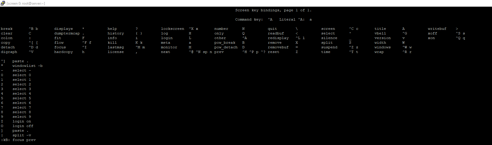
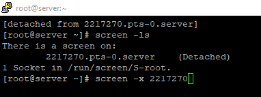
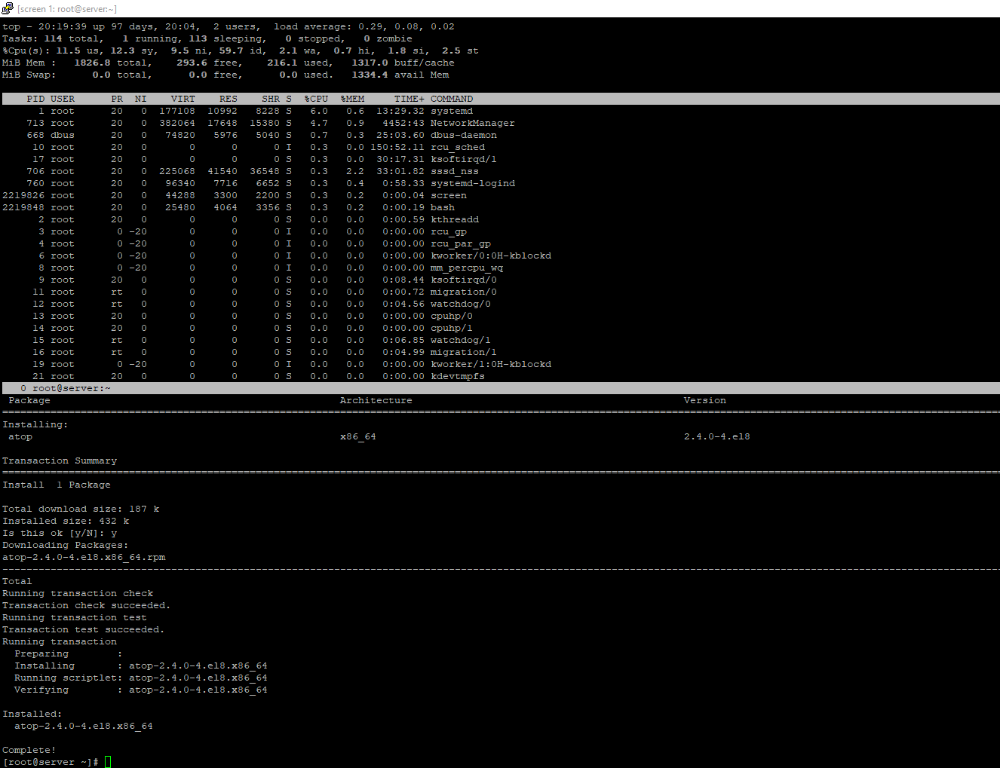
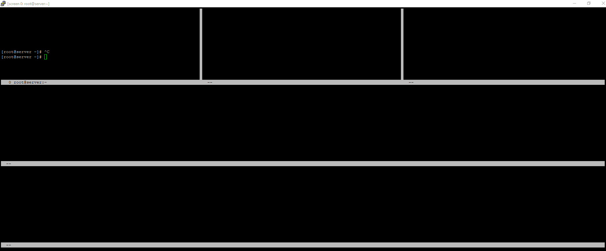
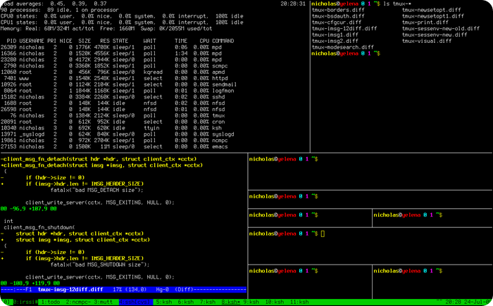
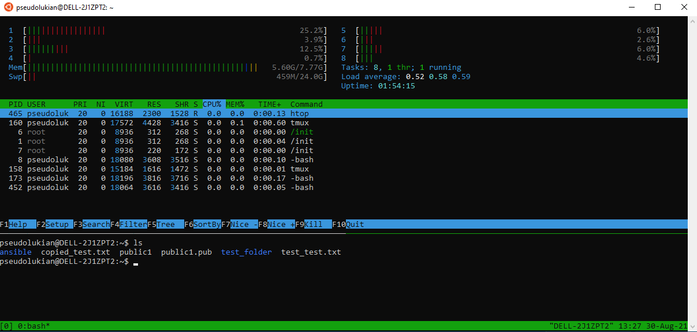
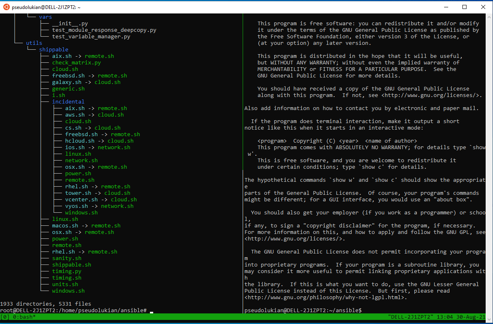
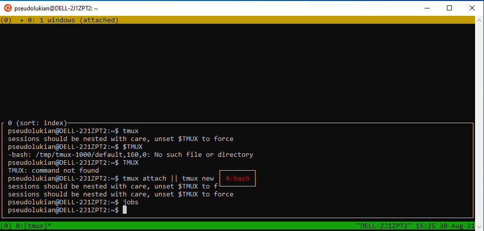

---
## Front matter
lang: ru-RU
title: Утилиты-мультиплексоры screen и tmux.
author: |
	 Баазова Нина Эдгаровна\inst{1}

institute: |
	\inst{1}Российский Университет Дружбы Народов

date: 19 марта, 2024, Москва, Россия

## Formatting
mainfont: PT Serif
romanfont: PT Serif
sansfont: PT Sans
monofont: PT Mono
toc: false
slide_level: 2
theme: metropolis
header-includes: 
 - \metroset{progressbar=frametitle,sectionpage=progressbar,numbering=fraction}
 - '\makeatletter'
 - '\beamer@ignorenonframefalse'
 - '\makeatother'
aspectratio: 43
section-titles: true

---

## Докладчик

 * Баазова Нина Эдгаровна
 * студент НБИ-02-23
 * Российский университет дружбы народов
 * [1132239096@pfur.ru]

## Цели работы

Изучить тему: "Утилиты-мультиплексоры screen и tmux".

## Введение

Утилиты-мультиплексоры screen и tmux являются мощными инструментами для работы в 
терминале в Unix-подобных системах. Они позволяют управлять несколькими сеансами 
терминала в одном окне, разделять окно терминала на несколько панелей, создавать 
окна и многое другое. 

С помощью этих утилит можно эффективно работать с несколькими 
задачами одновременно и упростить управление окружением терминала.

## Утилита Screen

* Screen – консольная утилита позволяющая в действующей SSH сессии открывать неограниченное количество независимых виртуальных терминалов (окон). Процессы, выполняемые внутри screen, не прерываются даже при обрыве сессии с сервером.

* Утилита screen является отличным инструментом как для новичков в Linux, так и для опытных системных администраторов. Внутри сессии screen можно запускать процессы, которые требуют длительное время на выполнения. В это же время вы всегда можете просто закрыть консоль и запущенный процесс будет выполняться в фоне.

## Утилита Screen

* Установка screen в Fedora yum install screen. Запустите сессию screen одной командой  screen. Чтобы вывести справку по использованию screen, нажмите комбинацию ctrl + a и после этого введите знак вопроса (?)(рис 1).

## Справка по использованию

{ #fig:001 width=70% height=70% }

## Утилита Screen

Вернуться к сессии screen можно через кнопку пробел. Чтобы полностью закрыть терминал screen, нажмите сочетание клавиш ctrl +d. Чтобы просто выйти из сессии screen, не закрывая ее полностью, используйтекомбинацию: Ctrl +a d. Если у вас открыта одна сессия screen, вернуться к ней можно с помощью команды: screen -r. Проверить список запущенных сессий screen: screen -list или screen -ls (рис 2). 

## Команда screen -ls

{ #fig:002 width=70% height=70% }

## Утилита Screen

Есть еще очень удобная функция в screen — это разделение экрана (split). Экран можно делить как по горизонтали, так и по вертикали. Например, чтобы разделить экран по горизонтали, в сессии screen нужно нажать ctrl+a S. Экран разделится на две части. Чтобы переключиться на вторую часть, введите ctrl+a tab и после переключения для активации ctrl+a c. Одновременно в двух частях, можно запускать нужные скрипты или утилиты(рис 3). Чтобы разделить экран по вертикали, используйте ctrl+a. Более того, разделителей может быть неограниченно количество (рис 4). 

## Запуск нескольких скриптов

{ #fig:003 width=70% height=70% }

## Пример разделения окон

{ #fig:004 width=70% height=70% }

## Основные команды для работы с утилитой Screen:

- `screen` - запуск нового сеанса
- `Ctrl+a d` - отсоединиться от текущего сеанса
- `screen -r` - подключиться к отсоединенному сеансу

## Утилита Tmux

Tmux - это более современный аналог утилиты Screen, который обладает богатым набором функций и возможностей для работы с терминалом. Tmux также позволяет создавать несколько сеансов, окон и панелей, при этом предоставляя более гибкие настройки и возможности для пользователей (рис 5).

Установка Tmux в Fedora dnf install tmux. Команда запуска tmux.

## Примеры сеансов Tmux.

{ #fig:005 width=70% height=70% }

## Утилита Tmux

**Новое окно** (нажать CTRL+b, затем нажать с) <C-b c> .

**Переключение** 

* <C-b n> // следующее окно
* <C-b p> // предыдущее окно
* <C-b 0> // переключиться на номер окна

**Деление окна горизонтально** <C-b "> или tmux split-window -h (рис 6).

**Деление окна вертикально** <C-b %> или mux split-window -v (рис 7).

## Утилита Tmux

**Закрытие окон** <C-b x> // нужно подтвердить y или exit.

**Отключение от сессии** <C-b d> или tmux detach.

**Список сессий** tmux ls.

**Выбрать сессию** <C-b s> (рис 8).

## Пример деления окон горизонтально

{ #fig:006 width=70% height=70% }

## Пример деления окон вертикально

{ #fig:007 width=70% height=70% }

## Пример выбора сессии

{ #fig:008 width=70% height=70% }

## Основные команды для работы с утилитой Tmux:

- `tmux` - запустить новый сеанс

- `Ctrl+b d` - отсоединиться от текущего сеанса

- `tmux attach` - подключиться к отсоединенному сеансу

## Сравнение Screen и Tmux 

Обе утилиты предоставляют аналогичные функциональные возможности, но Tmux имеет более продвинутый и гибкий интерфейс, а также поддерживает более сложные конфигурации окон и панелей. Screen является более простым в использовании и имеет более широкое распространение из-за своей долгой истории.

## Заключение 

Утилиты-мультиплексоры Screen и Tmux являются незаменимыми инструментами для 
работы в терминале, позволяя повысить производительность и эффективность работы с 
командной строкой. Выбор между Screen и Tmux будет зависеть от индивидуальных 
предпочтений и требований пользователя, однако обе утилиты заслуживают внимания 
благодаря своей функциональности и удобству использования.

## Вывод и источники

Mы изучили тему: "Утилиты-мультиплексоры screen и tmux".

Ссылки на источники:

1. [Использование утилиты screen в Linux](https://winitpro.ru/index.php/2021/02/05/ispolzovanie-utility-screen-v-linux/)
2. [Как пользоваться утилитой screen в Linux?](https://wiki.merionet.ru/articles/kak-polzovatsya-utilitoj-screen-v-linux)
3. [Что такое tmux](https://habr.com/ru/articles/516488/)
4. [Шпаргалка по работе с Tmux](https://habr.com/ru/articles/327630/)
5. [Шпаргалка по tmux](https://losst.pro/shpargalka-po-tmux)
6. [Утилита-мультиплексор tmux](https://linux-notes.org/utilita-mul-tipleksor-tmux/)
7. [Шпаргалка по Tmux: установка, настройка, работа.](https://1cloud.ru/help/linux/tmux_help)
