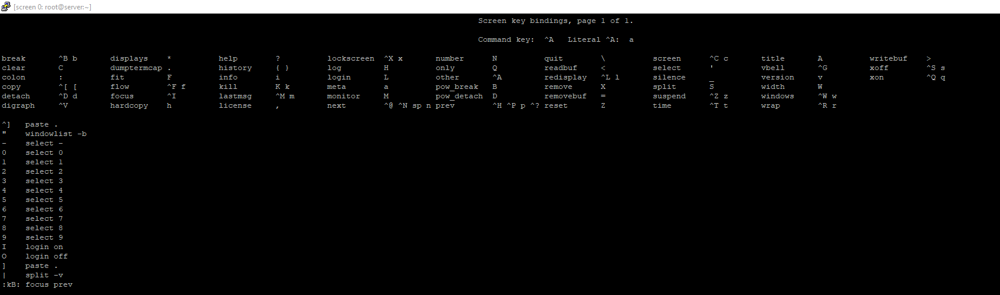
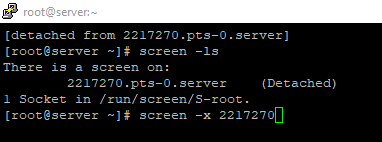
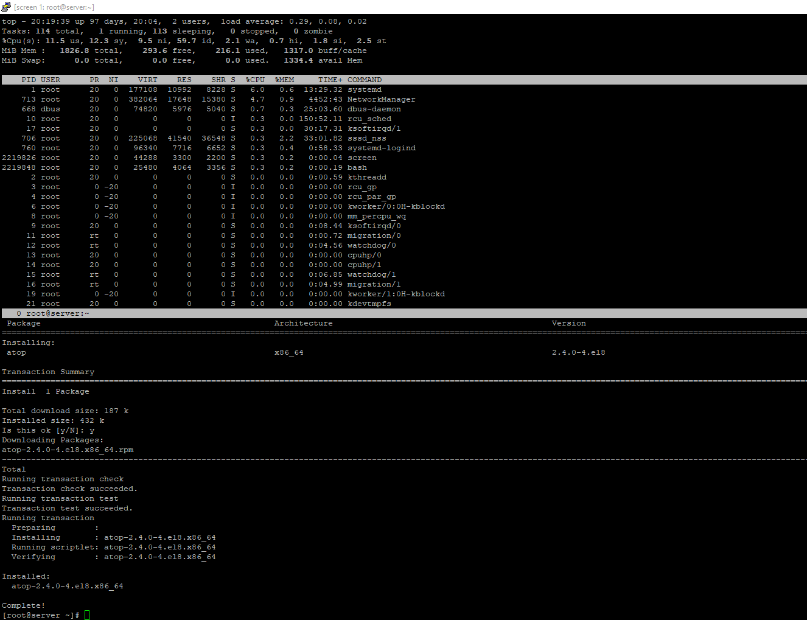
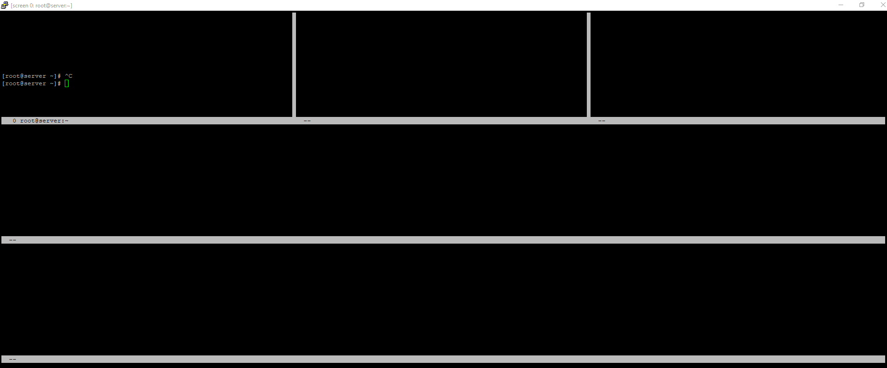
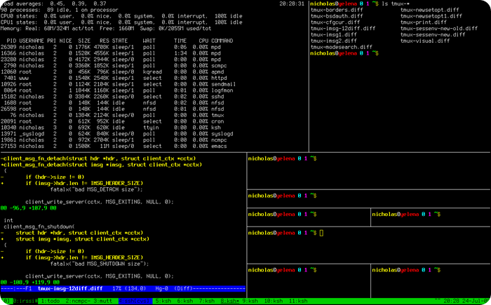
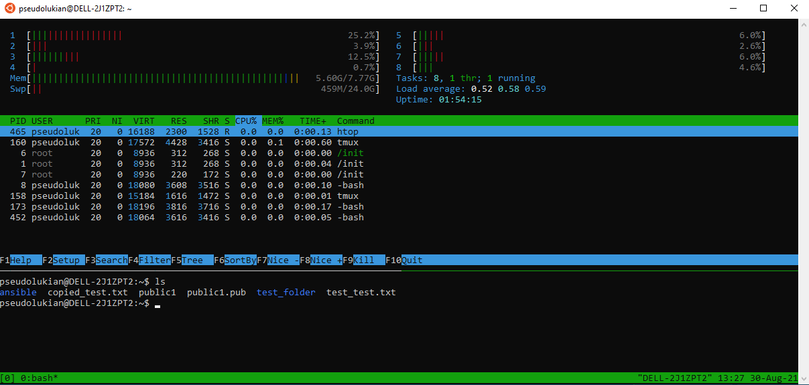
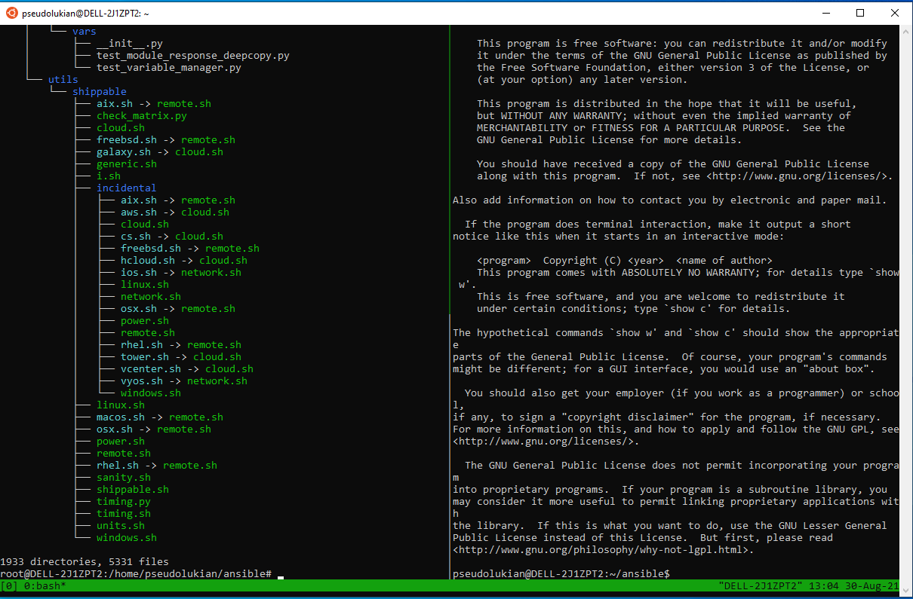
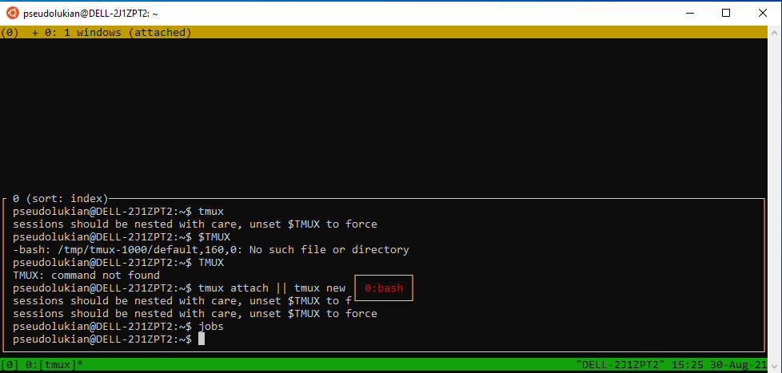

---
## Front matter
title: "Доклад на тему: Утилиты-мультиплексоры screen и tmux."
subtitle: "Дисциплина: Операционные системы"
author: "Баазова Нина Эдгаровна"

## Generic otions
lang: ru-RU
toc-title: "Содержание"

## Bibliography
bibliography: bib/cite.bib
csl: pandoc/csl/gost-r-7-0-5-2008-numeric.csl

## Pdf output format
toc: true # Table of contents
toc-depth: 2
lof: true # List of figures
lot: true # List of tables
fontsize: 12pt
linestretch: 1.5
papersize: a4
documentclass: scrreprt
## I18n polyglossia
polyglossia-lang:
  name: russian
  options:
	- spelling=modern
	- babelshorthands=true
polyglossia-otherlangs:
  name: english
## I18n babel
babel-lang: russian
babel-otherlangs: english
## Fonts
mainfont: PT Serif
romanfont: PT Serif
sansfont: PT Sans
monofont: PT Mono
mainfontoptions: Ligatures=TeX
romanfontoptions: Ligatures=TeX
sansfontoptions: Ligatures=TeX,Scale=MatchLowercase
monofontoptions: Scale=MatchLowercase,Scale=0.9
## Biblatex
biblatex: true
biblio-style: "gost-numeric"
biblatexoptions:
  - parentracker=true
  - backend=biber
  - hyperref=auto
  - language=auto
  - autolang=other*
  - citestyle=gost-numeric
## Pandoc-crossref LaTeX customization
figureTitle: "Рис."
tableTitle: "Таблица"
listingTitle: "Листинг"
lofTitle: "Список иллюстраций"
lotTitle: "Список таблиц"
lolTitle: "Листинги"
## Misc options
indent: true
header-includes:
  - \usepackage{indentfirst}
  - \usepackage{float} # keep figures where there are in the text
  - \floatplacement{figure}{H} # keep figures where there are in the text
---

# Цель работы

Изучить тему: "Утилиты-мультиплексоры screen и tmux".

# Введение

Утилиты-мультиплексоры screen и tmux являются мощными инструментами для работы в 
терминале в Unix-подобных системах. Они позволяют управлять несколькими сеансами 
терминала в одном окне, разделять окно терминала на несколько панелей, создавать 
окна и многое другое. С помощью этих утилит можно эффективно работать с несколькими 
задачами одновременно и упростить управление окружением терминала.

# Утилита Screen 

Screen – консольная утилита позволяющая в действующей SSH сессии открывать неограниченное количество независимых виртуальных терминалов (окон). Процессы, выполняемые внутри screen, не прерываются даже при обрыве сессии с сервером.

Утилита screen является отличным инструментом как для новичков в Linux, так и для опытных системных администраторов. Внутри сессии screen можно запускать процессы, которые требуют длительное время на выполнения. В это же время вы всегда можете просто закрыть консоль и запущенный процесс будет выполняться в фоне.

Установка screen в Fedora yum install screen. Запустите сессию screen одной командой  screen. Чтобы вывести справку по использованию screen, нажмите комбинацию ctrl + a и после этого введите знак вопроса (?)(рис 1).

{#fig:001 width=70%}

Вернуться к сессии screen можно через кнопку пробел. Чтобы полностью закрыть терминал screen, нажмите сочетание клавиш ctrl +d. Чтобы просто выйти из сессии screen, не закрывая ее полностью, используйтекомбинацию: Ctrl +a d. Если у вас открыта одна сессия screen, вернуться к ней можно с помощью команды: screen -r. Проверить список запущенных сессий screen: screen -list или screen -ls (рис 2). Если сессий несколько, можно получить ID сессии и подключиться к нужной: screen -x ID или screen -r ID. 

{#fig:002 width=70%}

Есть еще очень удобная функция в screen — это разделение экрана (split). Экран можно делить как по горизонтали, так и по вертикали. Например, чтобы разделить экран по горизонтали, в сессии screen нужно нажать ctrl+a S. Экран разделится на две части. Чтобы переключиться на вторую часть, введите ctrl+a tab и после переключения для активации ctrl+a c. Одновременно в двух частях, можно запускать нужные скрипты или утилиты(рис 3).

{#fig:003 width=70%}

Чтобы разделить экран по вертикали, используйте ctrl+a. Более того, разделителей может быть неограниченно количество (рис 4). Переключаемся по ним все также с помощью ctrl+a tab. Чтобы закрыть все разделители и остаться в активном окне, используйте ctrl+a Q или просто пропишите в консоли only.
Чтобы убрать умершие или зависшие сессии screen, используйте команду: screen -wipe.

{#fig:004 width=70%}

Основные команды для работы с утилитой Screen:

- `screen` - запуск нового сеанса
- `Ctrl+a d` - отсоединиться от текущего сеанса
- `screen -r` - подключиться к отсоединенному сеансу

# Утилита Tmux 

Tmux - это более современный аналог утилиты Screen, который обладает богатым 
набором функций и возможностей для работы с терминалом. Tmux также позволяет 
создавать несколько сеансов, окон и панелей, при этом предоставляя более гибкие 
настройки и возможности для пользователей (рис 5).

{#fig:005 width=70%}

Установка Tmux в Fedora dnf install tmux. Команда запуска tmux. 
tmux new -s session1 //новая сессия session1 
Название отображается снизу-слева в квадратных скобках в статус строке. Далее идет перечисление окон. Текущее окно помечается звездочкой. 

Префикс (с него начинаются команды) <C-b> (CTRL + b).

Новое окно (нажать CTRL+b, затем нажать с) <C-b c> .

Список окон <C-b w> // переключиться курсором вверх-вниз.

Переключение 

<C-b n> // следующее окно

<C-b p> // предыдущее окно

<C-b 0> // переключиться на номер окна

Деление окна горизонтально <C-b "> или tmux split-window -h (рис 6).

{#fig:006 width=70%}

Деление окна вертикально <C-b %> или mux split-window -v (рис 7).

{#fig:007 width=70%}

Переход между панелей <C-b стрелки курсора> // либо режим мыши.

Закрытие окон <C-b x> // нужно подтвердить y или exit.
Отключение от сессии <C-b d> или tmux detach.
Список сессий tmux ls.

Выбрать сессию <C-b s> (рис 8).

{#fig:008 width=70%}

Завершение сессии tmux kill-session -t session1.
Завершить все сессии tmux kill-server.
Список поддерживаемых комманд tmux list-commands.
Дополнительная информация man tmux.

Основные команды для работы с утилитой Tmux:

- `tmux` - запустить новый сеанс
- `Ctrl+b d` - отсоединиться от текущего сеанса
- `tmux attach` - подключиться к отсоединенному сеансу

#  Сравнение Screen и Tmux 

Обе утилиты предоставляют аналогичные функциональные возможности, но Tmux имеет 
более продвинутый и гибкий интерфейс, а также поддерживает более сложные 
конфигурации окон и панелей. Screen является более простым в использовании и имеет 
более широкое распространение из-за своей долгой истории.

# Заключение 

Утилиты-мультиплексоры Screen и Tmux являются незаменимыми инструментами для 
работы в терминале, позволяя повысить производительность и эффективность работы с 
командной строкой. Выбор между Screen и Tmux будет зависеть от индивидуальных 
предпочтений и требований пользователя, однако обе утилиты заслуживают внимания 
благодаря своей функциональности и удобству использования.

# Вывод

Mы изучили тему: "Утилиты-мультиплексоры screen и tmux".

# Список литературы{.unnumbered}

1. [Использование утилиты screen в Linux](https://winitpro.ru/index.php/2021/02/05/ispolzovanie-utility-screen-v-linux/)
2. [Как пользоваться утилитой screen в Linux?](https://wiki.merionet.ru/articles/kak-polzovatsya-utilitoj-screen-v-linux)
3. [Что такое tmux](https://habr.com/ru/articles/516488/)
4. [Шпаргалка по работе с Tmux](https://habr.com/ru/articles/327630/)
5. [Шпаргалка по tmux](https://losst.pro/shpargalka-po-tmux)
6. [Утилита-мультиплексор tmux](https://linux-notes.org/utilita-mul-tipleksor-tmux/)
7. [Шпаргалка по Tmux: установка, настройка, работа.](https://1cloud.ru/help/linux/tmux_help)

